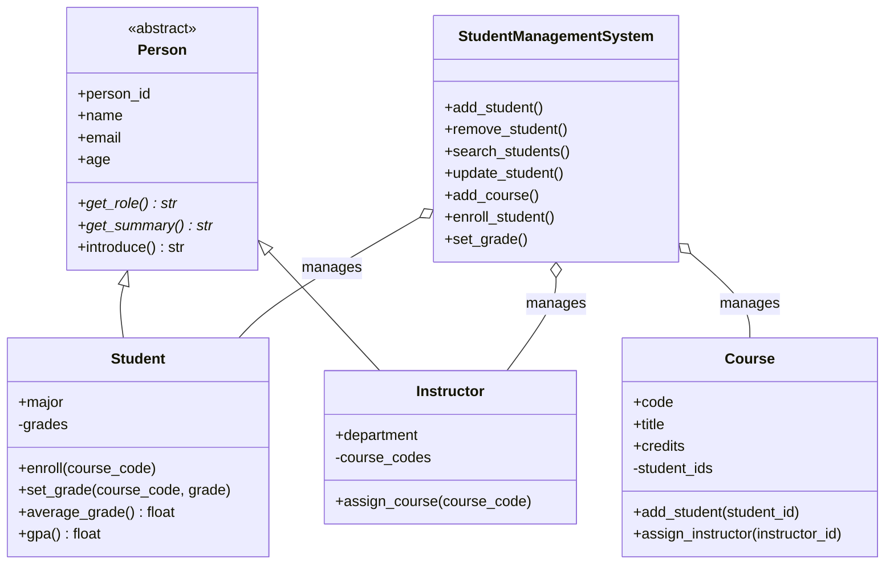

<div align="center">

# Student Management System

A console-based Python application that demonstrates core **Object-Oriented Programming** concepts.


</div>

---

## Table of Contents

1. [Project Description](#project-description)
2. [Project Features](#project-features)
3. [OOP Concepts Used](#oop-concepts-used)
4. [Class Design](#class-design)
5. [Project Structure](#project-structure)
6. [Requirements](#requirements)
7. [How to Run the Project](#how-to-run-the-project)
8. [Console Menu](#console-menu)
9. [Example Usage](#example-usage)
10. [Validation Rules](#validation-rules)
11. [Testing](#testing)
12. [Implementation](#implementation)
13. [Author](#author)

---

## Project Description

The Student Management System lets you manage **students**, **instructors** and **courses** from a simple text menu. All data is stored in memory (no database), so the project stays focused on **OOP design, input validation and exception handling**. It is written for a university OOP assignment and kept at a basic-to-intermediate level.

## Project Features

- **Students:** add, remove, search (by ID or name), display all, and update information
- **Courses:** add courses and display all courses
- **Enrollment:** enroll students in courses and display a student's courses
- **Grades:** add or update a grade (0–100) for an enrolled course
- **Results:** calculate and display a student's **average grade** and **GPA** (4.0 scale)
- **Instructors:** add instructors and assign them to courses
- **Validation:** clear error messages for invalid names, emails, ages, grades and duplicates
- **OOP demo:** a built-in menu option that shows inheritance, abstraction and polymorphism
- **Sample data:** a one-step loader with realistic records for quick testing
- **Unit tests:** automated tests for the main features

## OOP Concepts Used

| Concept | Implementation | File |
|---|---|---|
| **Classes & Objects** | `Person`, `Student`, `Instructor`, `Course`, `StudentManagementSystem` | `models/`, `services/` |
| **Encapsulation** | Private attributes (`__grades`, `__student_ids`, `__course_codes`); properties with validation for `name`, `email`, `age`; read-only ID; getters return **copies** of internal data | `models/*.py` |
| **Abstraction** | `Person` is an abstract class (`ABC`) with abstract methods `get_role()` and `get_summary()`; it **cannot** be instantiated | `models/person.py` |
| **Inheritance** | `Student` and `Instructor` inherit from `Person` and reuse its attributes and validation | `models/student.py`, `models/instructor.py` |
| **Polymorphism** | `Student` and `Instructor` override `get_role()` and `get_summary()`; one loop calls `introduce()` on every person and each object answers differently | `main.py` (option 14) |
| **Constructors** | `__init__` in every class; subclasses call `super().__init__()` | `models/*.py` |
| **Exception Handling** | Custom exceptions raised in models/services and caught in the menu loop, so the program never crashes on bad input | `exceptions/`, `main.py` |
| **Clean code** | Docstrings, meaningful names, small methods, one responsibility per module | all files |

## Class Design



## Project Structure

```
Student-Management-System/
├── src/
│   ├── main.py                        # Console menu (user interface)
│   ├── models/
│   │   ├── __init__.py
│   │   ├── person.py                  # Abstract base class
│   │   ├── student.py                 # Student (inherits Person)
│   │   ├── instructor.py              # Instructor (inherits Person)
│   │   └── course.py                  # Course information
│   ├── services/
│   │   ├── __init__.py
│   │   └── student_management.py      # StudentManagementSystem
│   └── exceptions/
│       ├── __init__.py
│       └── custom_exceptions.py       # Custom exception classes
├── tests/
│   └── test_student_management.py     # Unit tests
├── README.md
├── requirements.txt
└── .gitignore
```

**Separation of responsibilities:** `models/` holds the data and rules of each object, `services/` holds the operations that work across objects, `exceptions/` holds the error types, and `main.py` only talks to the user.

## Requirements

- Python **3.8 or newer**
- No external libraries (see `requirements.txt`)

## How to Run the Project

```bash
# 1. Get the project
git clone https://github.com/Mohanad234128/AItronix_Student_Management_System.git
cd AItronix_Student_Management_System/Student-Management-System

# 2. Start the program
python src/main.py
```

> On some systems use `python3` instead of `python`.

## Console Menu

```
 1. Add student              9. Display a student's courses
 2. Remove student          10. Add / update a grade
 3. Search for a student    11. Show GPA / average grade
 4. Display all students    12. Add instructor
 5. Update student          13. Assign instructor to course
 6. Add course              14. Demo: inheritance & polymorphism
 7. Display all courses     15. Load sample data
 8. Enroll student in course
 0. Exit
```

## Example Usage

```
Choose an option: 15
Sample data loaded (students S001-S002, instructor I001, courses CS101, CS201).

Choose an option: 11
Student ID: S001
Ahmed Ali: average = 88.50, GPA = 3.50 / 4.0

Choose an option: 10
Student ID: S001
Course code: CS101
Grade (0-100): 150
Error: Grade must be between 0 and 100.

Choose an option: 14
[Student] S001 | Ahmed Ali | ahmed@example.com | Age 20 | Major: Computer Science
[Student] S002 | Sara Hassan | sara@example.com | Age 19 | Major: Software Engineering
[Instructor] I001 | Dr. Omar Khaled | omar@example.com | Dept: Computer Science | Teaches: CS201
```

**GPA scale:** 90–100 = 4.0, 80–89 = 3.0, 70–79 = 2.0, 60–69 = 1.0, below 60 = 0.0. The GPA is the average of these points over all graded courses.

## Validation Rules

| Field | Rule |
|---|---|
| Name | Not empty; letters, spaces, hyphens, apostrophes and dots only |
| Email | Must look like `name@example.com`; must be unique |
| Age | Whole number from 16 to 100 |
| Grade | Number from 0 to 100; student must be enrolled in the course |
| Course code | Not empty, no spaces, unique (stored in upper case) |
| Credits | Whole number from 1 to 6 |
| Enrollment | A student cannot enroll twice in the same course |

Custom exceptions: `StudentManagementError` (base), `ValidationError`, `InvalidGradeError`, `StudentNotFoundError`, `CourseNotFoundError`, `InstructorNotFoundError`, `DuplicateEntryError`, `EnrollmentError`.

## Testing

```bash
python -m unittest discover -s tests -v
```

The 9 tests cover adding/searching/removing students, validation errors, safe updates, enrollment, grades and GPA, encapsulation, abstraction, inheritance and polymorphism.

## Implementation

**Implementation Type:** Multi-file Python Project

## Author

**Mohanad Ibrahim**
